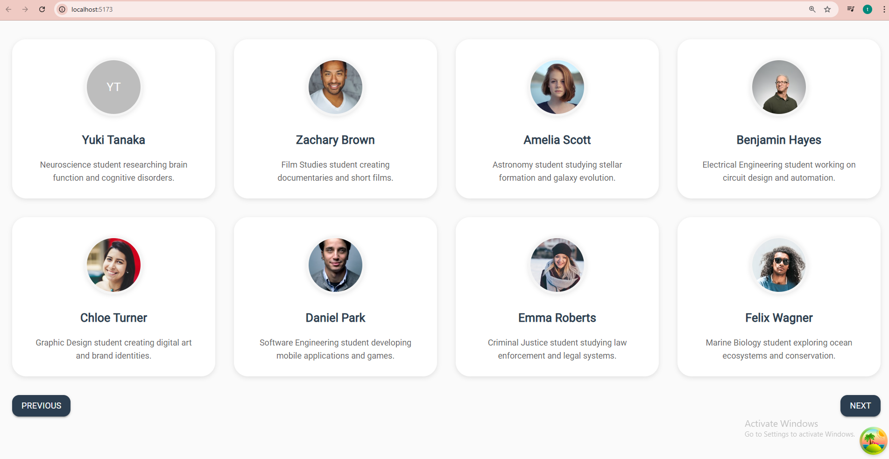

# TanStack Query Pagination with Material-UI



A modern React application demonstrating data fetching with TanStack Query v5, Material-UI components, and JSON Server for backend simulation.

## 🖼️ Preview


_Student cards displayed in a responsive 4-column grid layout with clean Material-UI design_

## 🚀 Features

- **TanStack Query v5** for efficient data fetching and caching
- **Material-UI v5** for modern, responsive UI components
- **Axios** for HTTP requests
- **JSON Server** for mock API backend
- **100 Student Records** with realistic dummy data
- **Responsive Grid Layout** (4 cards per row on desktop)
- **Loading States** with elegant spinners
- **Error Handling** with user-friendly messages
- **Hover Effects** for enhanced user interaction

## 📋 Prerequisites

Before running this project, make sure you have:

- **Node.js** (v16 or higher)
- **npm** or **yarn** package manager
- Basic knowledge of **React** and **JavaScript**

## 🛠️ Installation & Setup

### 1. Clone or Download the Project

```bash
git clone <your-repo-url>
cd tanstack-query-pagination
```

### 2. Install Dependencies

```bash
npm install
```

### 3. Start the JSON Server (Backend)

```bash
npm run server
```

This starts the mock API server on `http://localhost:3001`

### 4. Start the React App (Frontend)

```bash
npm run dev
```

This starts the React development server on `http://localhost:5173`

## 🎯 Main Concepts Tutorial

### 1. **TanStack Query Integration**

TanStack Query (formerly React Query) provides powerful data fetching capabilities:

```jsx
import { useQuery } from "@tanstack/react-query";
import axios from "axios";

const fetchStudents = async () => {
  const response = await axios.get("http://localhost:3001/students");
  return response.data;
};

function App() {
  const {
    data: studentsData,
    isLoading,
    error,
    refetch,
  } = useQuery({
    queryKey: ["students"],
    queryFn: fetchStudents,
  });
}
```

**Key Benefits:**

- ✅ **Automatic caching** - Data is cached and reused
- ✅ **Background updates** - Fresh data fetched automatically
- ✅ **Loading states** - Built-in loading and error states
- ✅ **Error handling** - Automatic retry logic

### 2. **Material-UI Grid System**

Modern responsive layout using Material-UI's Grid component:

```jsx
<Grid container spacing={4}>
  {studentsData?.map((student) => (
    <Grid size={{ xs: 12, sm: 6, md: 3 }} key={student.id}>
      <Card>{/* Card content */}</Card>
    </Grid>
  ))}
</Grid>
```

**Responsive Breakpoints:**

- `xs: 12` → 1 card per row (mobile)
- `sm: 6` → 2 cards per row (tablet)
- `md: 3` → 4 cards per row (desktop)

### 3. **Clean Style Organization**

Instead of messy inline styles, organize them at the bottom:

```jsx
// ❌ Messy inline styles
<Card sx={{ height: '100%', borderRadius: 2, boxShadow: '0 2px 8px...' }}>

// ✅ Clean organized styles
<Card sx={cardStyles}>

// Styles defined at bottom
const cardStyles = {
  height: '100%',
  borderRadius: 2,
  boxShadow: '0 2px 8px rgba(0,0,0,0.1)',
  // ... more styles
};
```

### 4. **JSON Server Setup**

Mock backend API with `db.json`:

```json
{
  "students": [
    {
      "id": 1,
      "name": "Alice Johnson",
      "description": "Computer Science student...",
      "avatar": "https://images.unsplash.com/..."
    }
  ]
}
```

**Available Endpoints:**

- `GET /students` - Get all students
- `GET /students/:id` - Get student by ID
- `POST /students` - Create new student
- `PUT /students/:id` - Update student
- `DELETE /students/:id` - Delete student

### 5. **Error Handling Pattern**

Proper loading and error states:

```jsx
if (isLoading) {
  return (
    <Container sx={loadingContainerStyles}>
      <CircularProgress size={60} />
    </Container>
  );
}

if (error) {
  return (
    <Container sx={errorContainerStyles}>
      <Alert severity="error">Failed to load students: {error.message}</Alert>
    </Container>
  );
}
```

## 📁 Project Structure

```
src/
├── App.jsx                 # Main application component
├── main.jsx               # App entry point with providers
├── index.css              # Global styles
└── db.json                # JSON Server database
```

## 🔧 Available Scripts

| Command           | Description                    |
| ----------------- | ------------------------------ |
| `npm run dev`     | Start React development server |
| `npm run server`  | Start JSON Server (mock API)   |
| `npm run build`   | Build for production           |
| `npm run preview` | Preview production build       |

## 🎨 Customization

### Adding More Students

Edit `db.json` and add more student objects with:

- `id` - Unique identifier
- `name` - Student full name
- `description` - Brief description
- `avatar` - Profile image URL

### Changing Grid Layout

Modify the Grid `size` prop:

```jsx
// For 3 cards per row
<Grid size={{ xs: 12, sm: 6, md: 4 }}>

// For 6 cards per row
<Grid size={{ xs: 12, sm: 4, md: 2 }}>
```

### Custom Styling

Update the style objects at the bottom of `App.jsx`:

```jsx
const cardStyles = {
  // Your custom styles here
  backgroundColor: "#f5f5f5",
  borderRadius: 3,
  // ...
};
```

## 🔍 Key Learning Points

1. **TanStack Query** simplifies API calls and state management
2. **Material-UI** provides professional, accessible components
3. **Axios** offers cleaner HTTP requests than fetch()
4. **JSON Server** enables rapid API prototyping
5. **Organized styles** make code more maintainable
6. **Responsive design** ensures mobile compatibility

## 🚀 Next Steps

- Add **pagination** for large datasets
- Implement **search** and **filtering**
- Add **CRUD operations** (Create, Update, Delete)
- Include **optimistic updates**
- Add **infinite scrolling**
- Implement **data mutations**

## 📚 Resources

- [TanStack Query Documentation](https://tanstack.com/query/latest)
- [Material-UI Documentation](https://mui.com/material-ui/)
- [Axios Documentation](https://axios-http.com/)
- [JSON Server Guide](https://github.com/typicode/json-server)

---

**Happy Coding! 🎉**
