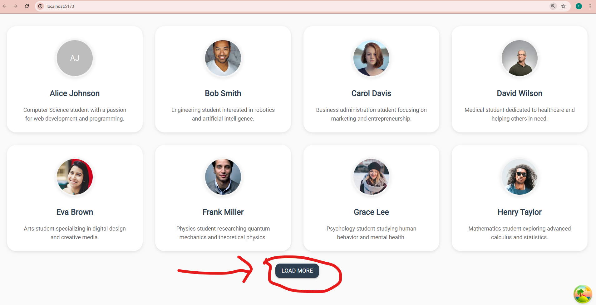

# TanStack Query Pagination Demo


A full-stack application demonstrating **cursor-based pagination** implementation using TanStack Query (React Query) v5, Material-UI, and Express.js.

## 🚀 Features

- **Cursor-based pagination** for efficient data loading
- **TanStack Query v5** for server state management
- **Material-UI** for beautiful, responsive UI components
- **Express.js** backend with pagination API
- **Concurrent development** setup with hot reload
- **ESM modules** throughout the project

## 📁 Project Structure

```
cursor-based-pagination/
├── client/                 # React frontend
│   ├── src/
│   │   ├── App.jsx        # Main application component
│   │   ├── main.jsx       # React entry point
│   │   └── assets/        # Static assets
│   ├── package.json       # Client dependencies
│   └── vite.config.js     # Vite configuration
├── server/                 # Express backend
│   ├── index.js           # Server entry point
│   ├── studentsData.js    # Mock data
│   └── package.json       # Server dependencies
└── package.json           # Root workspace configuration
```

## 🛠️ Tech Stack

### Frontend

- **React 19** - UI library
- **TanStack Query v5** - Server state management
- **Material-UI v7** - Component library
- **Axios** - HTTP client
- **Vite** - Build tool and dev server

### Backend

- **Express.js** - Web framework
- **CORS** - Cross-origin resource sharing
- **Nodemon** - Development auto-reload

## 📦 Installation

1. **Clone the repository:**

   ```bash
   git clone <your-repo-url>
   cd cursor-based-pagination
   ```

2. **Install dependencies:**

   ```bash
   npm install
   ```

   This will install dependencies for both client and server using npm workspaces.

## 🚀 Usage

### Development Mode

Start both client and server concurrently:

```bash
npm run dev
```

This will:

- Start the Express server on `http://localhost:3000`
- Start the React client on `http://localhost:5173`

### Individual Commands

**Start server only:**

```bash
npm run start-server
```

**Start client only:**

```bash
npm run start-client
```

**Build for production:**

```bash
npm run build
```

**Start production server:**

```bash
npm start
```

## 📡 API Endpoints

### GET `/api/students`

Fetch students with cursor-based pagination.

**Query Parameters:**

- `cursor` (optional): ID of the last item from previous page (default: 0)
- `limit` (optional): Number of items per page (default: 8, max: 50)

**Example Request:**

```bash
curl "http://localhost:3000/api/students?cursor=0&limit=8"
```

**Example Response:**

```json
{
  "data": [
    {
      "id": "1",
      "name": "Alice Johnson",
      "email": "alice.johnson@email.com",
      "course": "Computer Science",
      "year": 2,
      "avatar": "https://api.dicebear.com/7.x/avataaars/svg?seed=Alice"
    }
  ],
  "hasMore": true,
  "nextCursor": 9
}
```

## 🔧 Key Implementation Details

### Cursor-based Pagination Benefits

- **Performance**: More efficient for large datasets
- **Consistency**: No duplicate items when data changes
- **Scalability**: Better performance as dataset grows

### TanStack Query Integration

- Uses `keepPreviousData` for smooth pagination experience
- Automatic caching and background updates
- Built-in loading and error states

### Material-UI Components

- Responsive grid layout
- Loading spinners and error alerts
- Consistent theming and styling

## 🧪 Development Features

- **Hot Module Replacement (HMR)** for instant updates
- **ESLint** configuration for code quality
- **Concurrent development** setup
- **CORS enabled** for cross-origin requests

## 📝 Scripts Reference

| Script                 | Description                                      |
| ---------------------- | ------------------------------------------------ |
| `npm run dev`          | Start both client and server in development mode |
| `npm run start-server` | Start Express server only                        |
| `npm run start-client` | Start React client only                          |
| `npm run build`        | Build client for production                      |
| `npm start`            | Start production server                          |

## 🤝 Contributing

1. Fork the repository
2. Create your feature branch (`git checkout -b feature/AmazingFeature`)
3. Commit your changes (`git commit -m 'Add some AmazingFeature'`)
4. Push to the branch (`git push origin feature/AmazingFeature`)
5. Open a Pull Request

## 📄 License

This project is open source and available under the [MIT License](LICENSE).

## 🔗 Related Resources

- [TanStack Query Documentation](https://tanstack.com/query/latest)
- [Material-UI Documentation](https://mui.com/)
- [Express.js Documentation](https://expressjs.com/)
- [Vite Documentation](https://vitejs.dev/)
